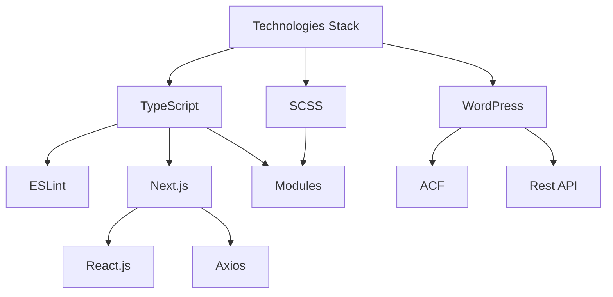

# Food Here

<!--

	
	
	
	
	
	
	

 -->

## Tl;dr

[Перейти на сайт](https://food.fb24m.ru)

[Админ-панель (логин и пароль - admin1)](https://fb24m.ru/food-here/wp-admin)

[Телеграм чат, куда поступают заказы](https://t.me/food_here)

Food Here - полностью рабочий сайт для заказа еды, написаный на Next.js с использованием WordPress и SCSS. Для поддержки стиля и надежности кода используются ESLint и TypeScript.

Использовано крайне мало компонентов с клиенстким рендерингом - страницы генерируются на сервере, а контент на них можно менять через админ-панель.

## Безопасность

Все токены и ключи доступа хранятся на сервере в зашифрованном виде. При заказе стоимость пересчитывается автоматически, чтобы не допустить ошибки. Для хранения данных используются Cookie.

## Wordpress

Wordpress вместе с основным плагином ACF играют роль бекенда сайта, через админ-панель можно менять товары и регионы для доставки, а также добавлять новые (вы можете сами добавить что угодно через панель по ссылке выше)

